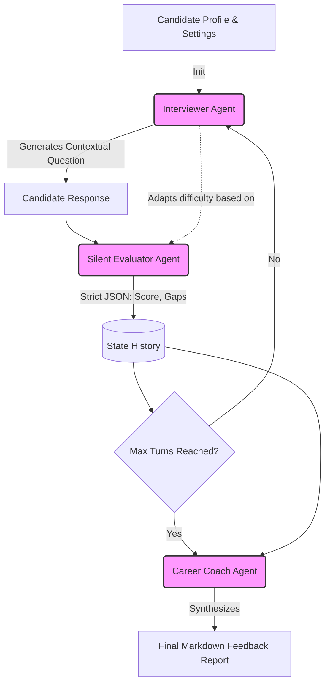

# 🎙️ AI Mock Interview Coach (Multi-Agent Architecture)

An AI-first prototype built to conduct dynamic, realistic mock interviews. Powered by Groq LLM APIs, Streamlit, and a modular multi-agent orchestration engine, this system adapts to candidate performance in real-time and provides structured, actionable coaching feedback.

## 🏗️ Architecture Overview

The system avoids heavy, black-box agent frameworks in favor of a clean, custom Python state-engine routing LLM calls. This ensures deterministic state management and prevents prompt leakage.

1. **Interviewer Agent (`llama-3.3-70b-versatile`):** Drives the conversation. It consumes the candidate's target role, resume snippet, and previous turn evaluations. It dynamically scales question difficulty up or down based on the Evaluator's real-time feedback. Prompted to avoid textbook questions in favor of trade-offs and failure modes.
2. **Silent Evaluator Agent (`llama-3.1-8b-instant`):** Asynchronous background scoring. It observes each Q&A pair and strictly outputs a JSON evaluation (`turn_score`, `technical_depth_score`, `difficulty_recommendation`). This prevents the main chat from being cluttered while informing the Interviewer's next move.
3. **Career Coach Agent (`llama-3.3-70b-versatile`):** Post-interview synthesis. Triggers at the end of the session. Consumes the complete array of JSON evaluations and the conversation transcript to generate a structured Markdown feedback report highlighting strengths, gaps, and a practice plan.



## ⚖️ Key Design Decisions & Trade-offs

* **Explicit Orchestration vs. Agent Frameworks:** Opted for direct API orchestration rather than using heavy frameworks. This requires writing custom state loops but drastically reduces latency, eliminates dependency bloat, and provides granular control over the evaluation context injection.
* **Strict JSON Forcing:** The Evaluator agent uses Groq's native `json_object` response format. This guarantees the UI and state manager will never crash from malformed string outputs or unexpected Markdown blocks.
* **Rate-Limit Resilience:** Because the system makes two LLM calls per turn (Interviewer + Evaluator), it can hit free-tier API rate limits. I implemented the `tenacity` library for exponential backoff to silently catch 429 errors and retry without breaking the Streamlit state.

## 🛠️ Setup & Execution

### 1. Prerequisites
* Python 3.11+ installed.

### 2. Installation
```bash
git clone https://github.com/ankitdash-1407/upgrad-ai-coach.git
cd upgrad-ai-coach

python -m venv venv
# On Windows:
.\venv\Scripts\activate
# On Mac/Linux:
source venv/bin/activate

pip install -r requirements.txt
```

### 3. Environment Variables
Create a `.env` file in the project root:
```env
GROQ_API_KEY=your_groq_api_key_here
```

### 4. Run the Application
```bash
streamlit run app.py
```

---

## 📝 Example Interview Transcripts

### Scenario 1: Strong Candidate (Data Analyst / Anomaly Detection)
> *Demonstrates the system handling deep technical architecture, dynamically escalating difficulty, and tracking context across multiple turns.*

**Interviewer:** Welcome. I'm the Hiring Manager for this Data Analyst role. We'll be diving straight into your technical background and practical problem-solving skills today. I see from your background that you built a real-time anomaly detection engine using RAG. In a live production setting, streaming data often experiences brief, benign spikes. How specifically did you tune your detection logic or retrieval context to filter out these transient false positives without introducing unacceptably high latency to your real-time alerts?

**Candidate:** To filter out transient false positives without introducing latency, I used a two-stage pipeline: an in-memory Redis TimeSeries pre-filter that required 3 consecutive out-of-bounds data points over a 60-second sliding window to drop 85% of short-lived spikes, followed by an HNSW vector search in Qdrant that used native metadata payload filtering to match remaining spikes against immediate and weekly cyclical baselines. To maintain a 6.4ms p99 latency at 13,500 QPS, the graph traversal utilized int8 quantization in RAM to pull the top 50 candidates, which were then re-scored to the top 10 using full float32 vectors via NVMe-backed memory-mapped files.

**Interviewer:** That dual-stage approach—using Redis TimeSeries for deterministic smoothing before offloading to quantized vector retrieval—is a solid architectural split for keeping p99 latency under 10ms. However, a known edge case with relying on cyclical baseline vector matching is a legitimate structural shift—like a deliberate code deployment or a scheduled marketing event—creating a permanent step-function increase in baseline metrics. How did your pipeline distinguish between a true anomaly and a permanent baseline step-change? Specifically, how did you handle updating or overriding the Qdrant baseline context in real time without introducing write locks?

**Candidate:** Distinction: A continuous statistical tracking window monitored post-spike metrics; if data remained elevated for over 15 minutes without reverting, it was classified as a permanent step-change rather than a transient anomaly. Context Updates: Instead of altering existing vectors—which triggers index re-segmentation delays—the pipeline upserted a new baseline context vector directly into Qdrant using a fresh timestamp metadata payload. Lock-Free Concurrency: Qdrant's Multi-Version Concurrency Control (MVCC) allowed these real-time writes to process concurrently with active searches via lock-free atomic pointers, completely bypassing read/write locks and preserving the 6.4ms p99 latency baseline.

*(Evaluator successfully logged high scores across Technical Depth and Problem Solving).*

---

### Scenario 2: Weak / Hostile Candidate (Graphics Designer)
> *Demonstrates the system successfully handling uncooperative inputs, gibberish, and hostility without breaking character, hallucinating, or crashing.*

**Interviewer:** Suppose you're working on a high-profile marketing campaign that requires creating visually appealing graphics for both web and print mediums, but you notice that the design elements and typography look slightly off when transitioning from one medium to the other. How would you specifically handle this inconsistency to ensure a cohesive brand image across all platforms?

**Candidate:** i export images as png i guess

**Interviewer:** Using PNG can help with image quality, but it doesn't directly address the issue of design inconsistencies across different mediums. Let's try to narrow down on the problem: When designing for both web and print, you often have to consider differences in resolution, color modes, and typography rendering. Specifically, how would you handle the fact that a design that looks good on a high-resolution screen might not translate well to a printed brochure?

**Candidate:** idk

**Interviewer:** No problem, let's pivot. A fundamental concept in graphics design is understanding color modes. Can you tell me the basic difference between RGB and CMYK color modes?

**Candidate:** axjyxhsukhdkchsijlis

**Interviewer:** Understood. Let's reset with a practical scenario regarding color modes. Suppose you're designing a logo that will be used both on a website and on printed business cards. What are the two main color modes you would consider for these different mediums?

**Candidate:** hate you

*(Evaluator successfully caught all edge cases, scored the Candidate appropriately low, and the Coach agent delivered corrective feedback without crashing).*

---

### Scenario 3: Tricky / "Dodger" Candidate (Product Manager)
> *Demonstrates the system handling a candidate who uses buzzwords to dodge the core question, successfully re-grounding them in the specifics.*

**Interviewer:** Describe a situation where you had to handle a difficult stakeholder as a Product Manager, and walk me through the specific steps you took to resolve the issue and achieve a positive outcome.

**Candidate:** I was working in wallmart. I had lots of clients there. lots of connections. I loved building team.

**Interviewer:** Let's narrow down on a specific aspect of your experience. You mentioned having lots of clients and connections at Walmart. Can you tell me about a particular client or stakeholder you had to negotiate with or convince to adopt a new idea or product, and how you approached that conversation?

**Candidate:** I had to sell the client many products. I used to sell 50 doorbells per day.

**Interviewer:** That's a notable sales volume. However, I'd like to delve deeper into the product management aspect. As a Product Manager, you would often need to gather feedback from customers to inform product decisions. Can you describe a situation where you received negative feedback from a customer about a product, and how you specifically collected, analyzed, and prioritized that feedback?

**Candidate:** I get feedback from those clients, i provide them commisons.

**Interviewer:** It sounds like you have some experience with client interactions. To further explore your product management skills, let's consider a scenario: suppose you're managing a product and receive feedback from 100 customers, but the feedback is inconsistent and contradictory. How would you systematically collect, analyze, and prioritize this feedback to make a data-driven decision?

**Candidate:** skip

*(Interviewer effectively lowered task complexity while attempting to re-ground the user in core PM responsibilities, closing the loop cleanly when the user skipped).*